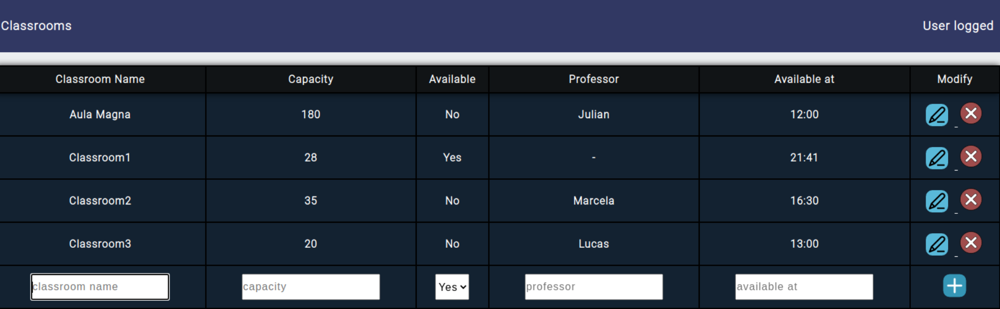

# SCHOOL M.S.

App created to solve the problem of disorganization in schools by having to 
assign a classroom or check if there is one available.

This project is being designed with a continuous release methodology in order
to constantly improve the application and carry out tests with possible users.

### VERSION 0.0.1-SNAPSHOT

Initial version, Classroom Table showing information about each classroom in
the school and allows CRUD operations on them.

### VERSION 1.0.0

Added login and register features with spring security.
Only users with director role can modify entries in the classroom table;